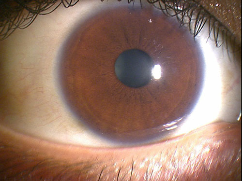

# Bilirubin Face Auth POC

This is a proof-of-concept (POC) app that simulates bilirubin level estimation using face authentication and conjunctiva images.

## 🔍 Features

- Simulates face authentication process
- Randomly selects one of three eye images (normal / mild / jaundiced)
- Displays bilirubin level with medical recommendation

## 🚀 Demo

Try it here:  
👉 [https://bilirubin-face-app-poc-hyp8gaaudru4lqg8xagkxr.streamlit.app/](https://bilirubin-face-app-poc-hyp8gaaudru4lqg8xagkxr.streamlit.app/)

## 📁 Files

- `bilirubin_face_auth_random_final_v6.py`: Main Streamlit app
- `normal_eye.jpg`, `mild_eye.jpg`, `high_eye.jpg`: Eye images used for simulation

## 📸 Example

## 🧑‍💻 Author

Created by [@ksmotty](https://github.com/ksmotty)
